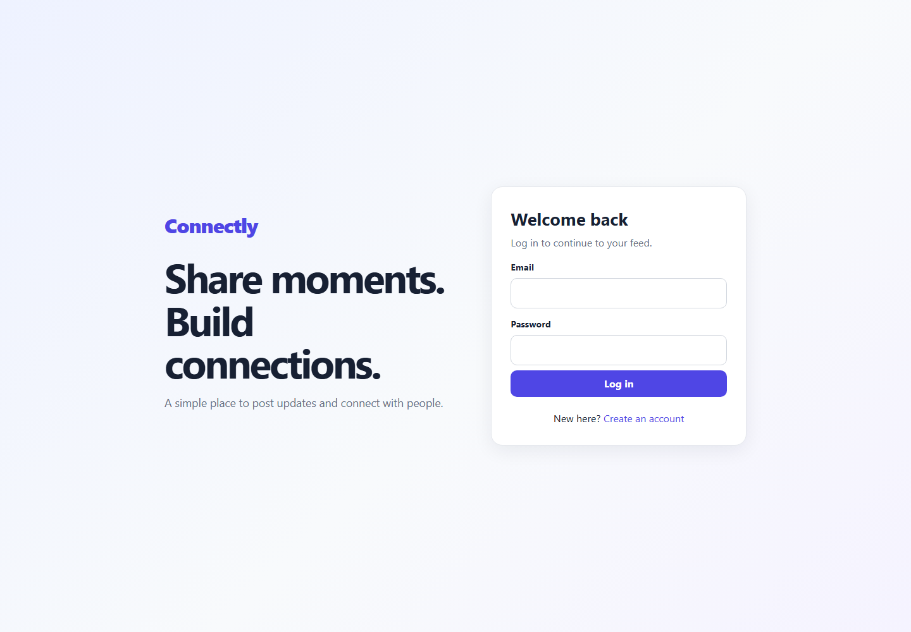
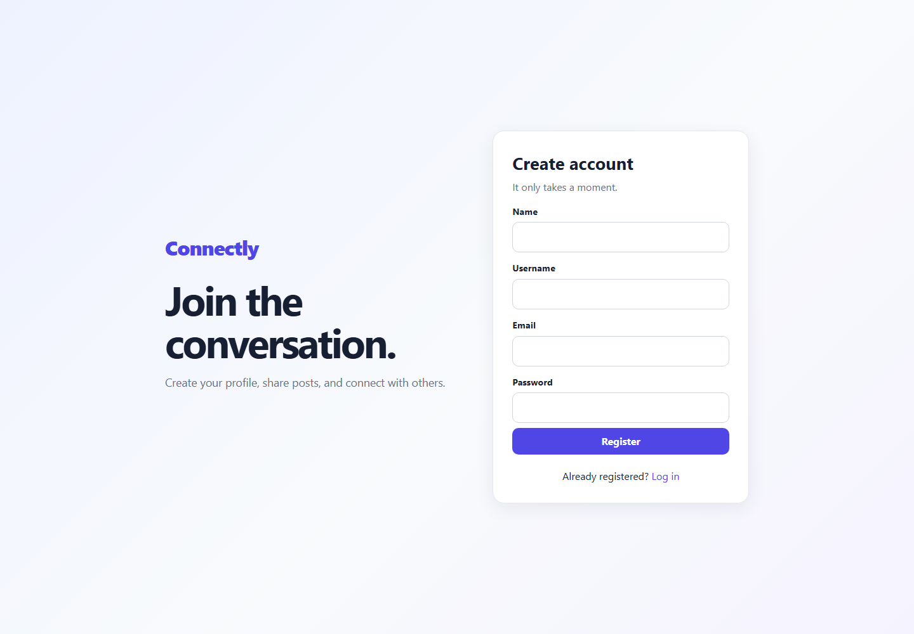
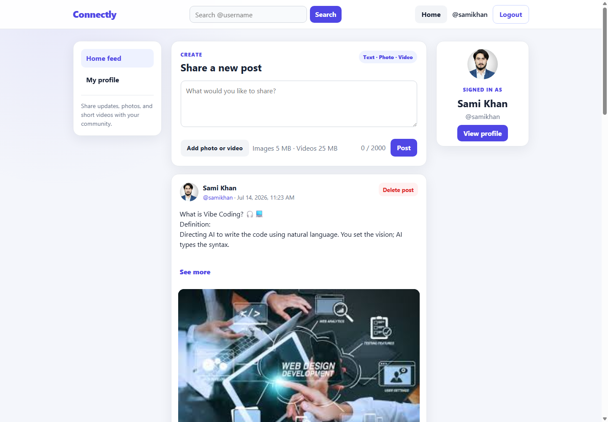
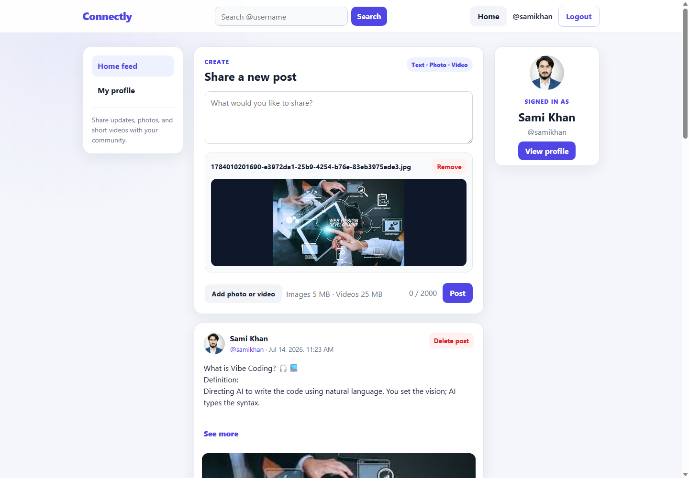
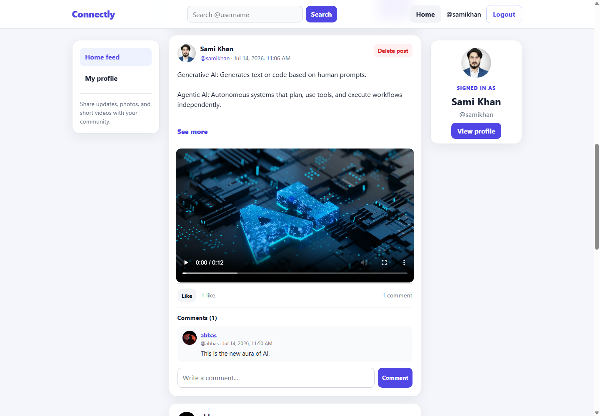
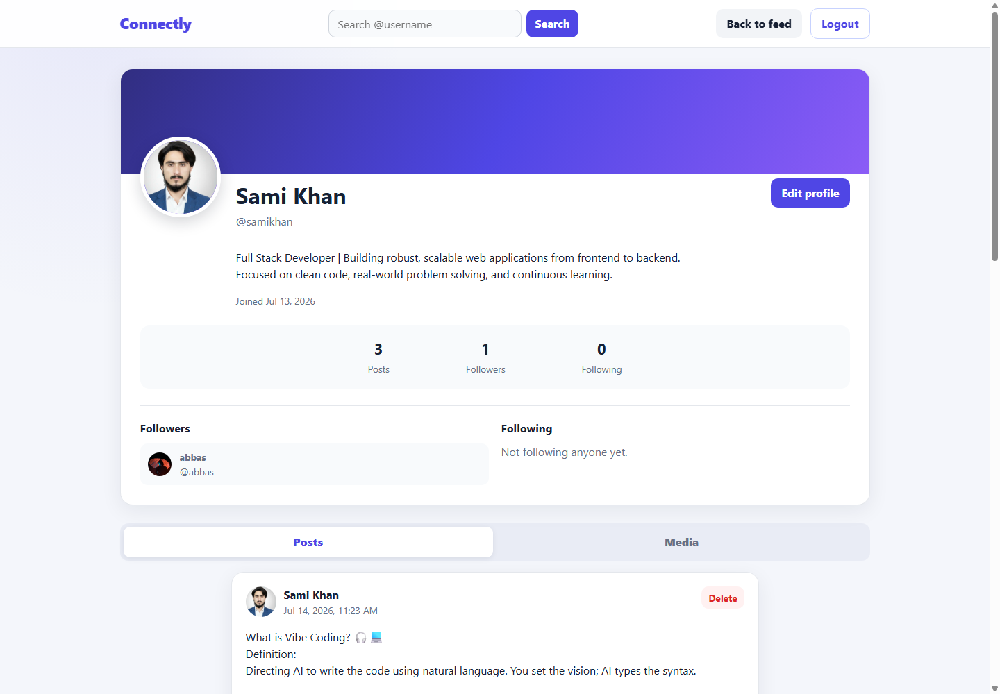
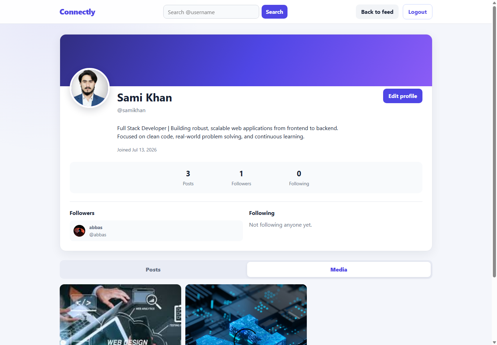
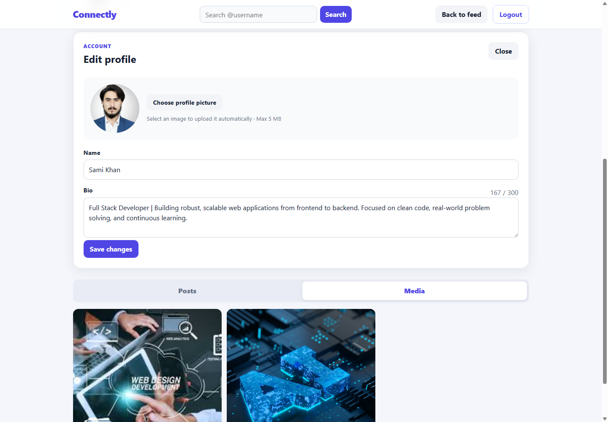
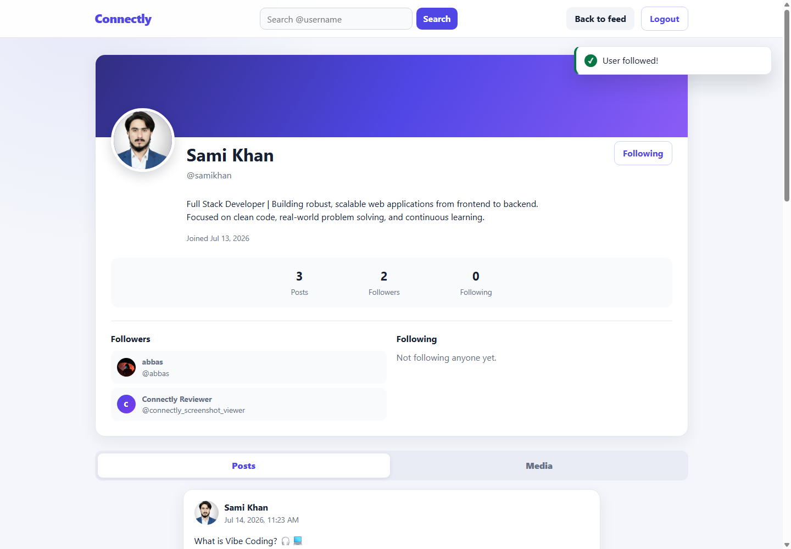
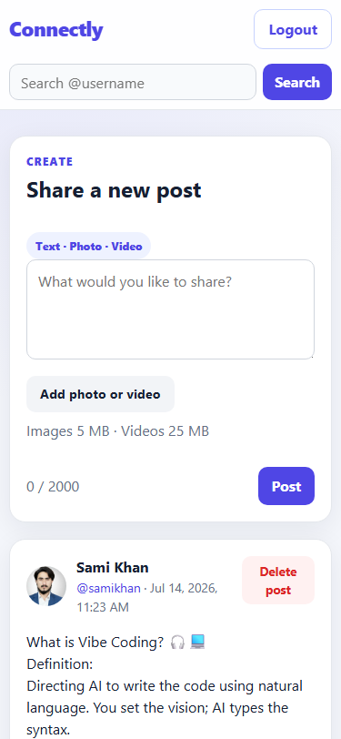

# Connectly

Connectly is a mini full-stack social media platform created for **CodeAlpha Full Stack Development Task 2**. It provides secure accounts, professional user profiles, social posts, media uploads, likes, comments, and follow relationships in a clean responsive interface.

## 1. Project Overview

The frontend uses semantic HTML, custom CSS, and vanilla JavaScript. The backend uses Node.js, Express.js, MongoDB, and Mongoose. JWT authentication protects private pages and API routes, while Multer handles local image and video uploads.

## 2. CodeAlpha Task Requirements

Connectly fulfills the required internship task:

- User profiles with profile editing and profile pictures
- Text, image, and video posts
- Comments on posts
- Like and unlike system
- Follow and unfollow system with follower/following counts
- HTML, CSS, and JavaScript frontend
- Express.js backend
- MongoDB collections for users, posts, comments, followers, following, and likes

## 3. Features

- Registration and login with bcrypt password hashing and JWT authentication
- Profile pictures, generated initials, editable names, and 300-character bios
- User search by username and clickable follower/following lists
- Text posts up to 2,000 characters with blue hashtags and See more/See less
- Image-only, video-only, and text-with-media posts
- Upload previews, removable selections, image lightbox, and HTML5 video controls
- Newest-first home feed plus profile Posts and Media tabs
- Like/unlike, comments, live counts, empty states, toasts, and loading states
- Owner-only post and comment deletion with confirmation dialogs
- Responsive layouts for mobile, tablet, laptop, and desktop
- Safe DOM construction without unsafe user-content `innerHTML`

## 4. Screenshots

| Login | Registration |
| --- | --- |
|  |  |

| Home feed | Image post preview |
| --- | --- |
|  |  |

| Video post | User profile |
| --- | --- |
|  |  |

| Profile media grid | Edit profile |
| --- | --- |
|  |  |

| Follow system | Mobile view |
| --- | --- |
|  |  |

## 5. Technology Stack

- Node.js and Express.js
- MongoDB and Mongoose
- HTML5, CSS3, and vanilla JavaScript
- JSON Web Tokens and bcryptjs
- Multer, dotenv, and CORS
- Nodemon for local development

No frontend framework, CSS framework, TypeScript, or paid media service is required.

## 6. Project Structure

```text
CodeAlpha_SocialMediaPlatform/
|-- config/database.js
|-- controllers/
|   |-- authController.js
|   |-- userController.js
|   |-- postController.js
|   `-- commentController.js
|-- middleware/
|   |-- authMiddleware.js
|   `-- uploadMiddleware.js
|-- models/
|   |-- User.js
|   |-- Post.js
|   `-- Comment.js
|-- public/
|   |-- css/style.css
|   |-- js/
|   |   |-- auth.js
|   |   |-- home.js
|   |   `-- profile.js
|   |-- index.html
|   |-- login.html
|   |-- register.html
|   `-- profile.html
|-- routes/
|-- uploads/
|   |-- images/.gitkeep
|   `-- videos/.gitkeep
|-- docs/screenshots/
|-- .env.example
|-- LICENSE
|-- package.json
|-- server.js
`-- README.md
```

Runtime uploads are ignored by Git; `.gitkeep` preserves the required folders.

## 7. Installation

```bash
git clone https://github.com/Sami-360/CodeAlpha_SocialMediaPlatform.git
cd CodeAlpha_SocialMediaPlatform
npm install
```

## 8. Environment Variables

Copy `.env.example` to `.env` and replace the placeholders:

```env
PORT=5000
MONGO_URI=your_mongodb_connection_string
JWT_SECRET=your_secure_jwt_secret
```

Never commit `.env`, database credentials, or JWT secrets.

## 9. MongoDB Setup

1. Create a free MongoDB Atlas cluster or use a local MongoDB server.
2. Create a database user in Atlas.
3. Add your current IP address under Atlas Network Access.
4. Copy the connection string into `MONGO_URI` in `.env`.
5. Use a long random value for `JWT_SECRET`.

Optional `MONGO_STANDARD_HOSTS` and `MONGO_REPLICA_SET` values are supported in `.env` when an ISP cannot resolve an Atlas SRV record. They are normally unnecessary.

## 10. Running the Application

Development mode:

```bash
npm run dev
```

Production-style mode:

```bash
npm start
```

Open the application at:

```text
http://localhost:5000
```

Use the Express URL instead of opening the HTML files directly or using VS Code Live Server.

## 11. Application Routes

| Page | URL |
| --- | --- |
| Home feed | `http://localhost:5000/` |
| Login | `http://localhost:5000/login.html` |
| Registration | `http://localhost:5000/register.html` |
| User profile | `http://localhost:5000/profile.html?username=USERNAME` |

## 12. API Endpoints

Protected endpoints require `Authorization: Bearer TOKEN`.

| Method | Endpoint | Purpose |
| --- | --- | --- |
| POST | `/api/auth/register` | Register and receive a JWT |
| POST | `/api/auth/login` | Log in and receive a JWT |
| GET | `/api/auth/me` | Get the authenticated user |
| GET | `/api/users/search?q=username` | Search users |
| GET | `/api/users/:username` | Get a profile and its posts |
| PUT | `/api/users/profile` | Update own name, bio, or profile picture |
| POST | `/api/users/:userId/follow` | Follow or unfollow a user |
| GET | `/api/posts` | Get the newest-first feed |
| POST | `/api/posts` | Create a text or media post |
| DELETE | `/api/posts/:postId` | Delete an owned post |
| POST | `/api/posts/:postId/like` | Like or unlike a post |
| GET | `/api/comments/:postId` | Get oldest-first comments |
| POST | `/api/comments/:postId` | Add a comment |
| DELETE | `/api/comments/:commentId` | Delete an owned comment |

## 13. Media Upload Rules

| Upload | Supported formats | Maximum size |
| --- | --- | --- |
| Post image | JPG, JPEG, PNG, WEBP, GIF | 5 MB |
| Profile picture | JPG, JPEG, PNG, WEBP, GIF | 5 MB |
| Post video | MP4, WEBM, MOV | 25 MB |

Each post accepts one media file. A post must contain text, an image, or a video. Requests with unsupported extensions, incompatible MIME types, or oversized files are rejected.

## 14. Security Features

- bcryptjs password hashing with passwords excluded from API responses
- Seven-day signed JWTs and protected routes
- Backend ownership checks for profile updates and content deletion
- Duplicate-safe likes, followers, and following with self-follow prevention
- Fixed upload directories, unique generated filenames, and safe deletion paths
- Backend validation for required fields and maximum lengths
- Uploaded media cleanup when posts are deleted or profile pictures are replaced
- Safe user-generated text rendering with `textContent` and DOM nodes
- `.env`, dependencies, logs, and runtime uploads excluded from Git

## 15. Testing Guide

1. Register User A and confirm automatic login.
2. Edit User A's name, bio, and profile picture.
3. Create text, image, and video posts.
4. Verify See more/See less and blue hashtags on long posts.
5. Like/unlike, add a comment, and delete owned content.
6. Log out and register User B.
7. Search for User A, open the profile, and follow/unfollow.
8. Confirm User B cannot delete User A's post or comment.
9. Test invalid login, duplicate accounts, empty posts, and unsupported uploads.
10. Check the interface at 375px, 768px, 1024px, and 1440px widths.

## 16. GitHub Repository

Repository: [https://github.com/Sami-360/CodeAlpha_SocialMediaPlatform](https://github.com/Sami-360/CodeAlpha_SocialMediaPlatform)

Repository owner: `Sami-360`

For a new local Git history:

```bash
git init
git add .
git commit -m "Complete CodeAlpha social media platform"
git branch -M main
git remote add origin https://github.com/Sami-360/CodeAlpha_SocialMediaPlatform.git
git push -u origin main
```

If a remote or Git history already exists, inspect it first and do not overwrite it.

## 17. Future Improvements

- Add pagination for very large feeds and comment lists.
- Add automated integration tests to a CI workflow.
- Move uploaded media to managed object storage for production deployment.

These are optional production improvements and are not required for CodeAlpha Task 2.

## 18. Author

Sami Ullah

## 19. License

This project is available under the [MIT License](LICENSE).
